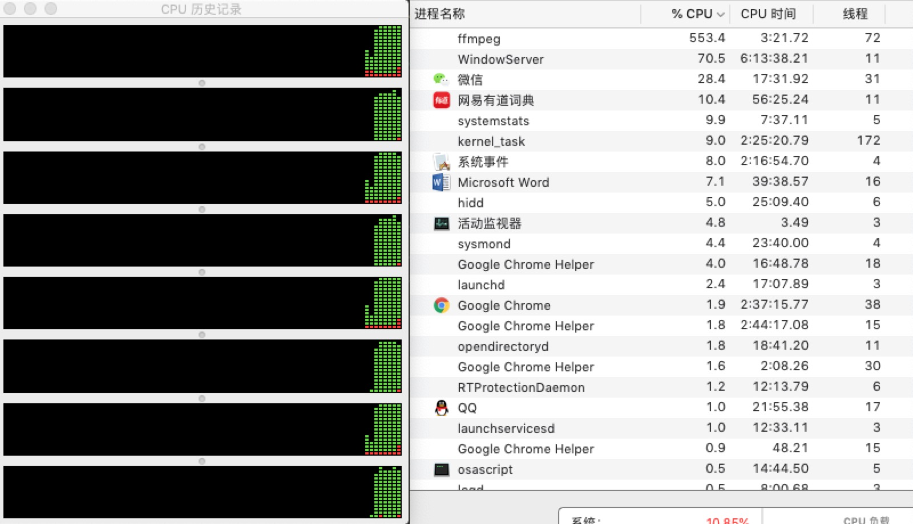

# exercise-2-ffmpeg-zywan
## This exercise it to use ffmpeg and multiprocessing to convert the video simultaneously.       
##### Run main.py  
then it will automatically convert all the videos in the current path. I use the pool to prevent a large amount of tasks at the same time. I also do the union test(Uni_test.py) to estimate whether the video convertion is successful or not.
### Estimation     
My labtop is 2014mid macbook pro, there is a 8 core cpu. when I run the code to convert one video, the machine will make use of all its power to do that by default.   
It seems that the machine could run 10 such tasks at the same time.   

